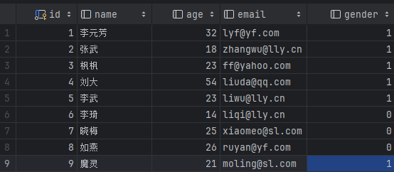

# 初始化表格内数据
```go

package main

import (
	"fmt"
	"gorm.io/driver/mysql"
	"gorm.io/gorm"
	"gorm.io/gorm/logger"
)

var DB *gorm.DB

type Student struct {
	ID     int     `gorm:"size:10"`
	Name   string  `gorm:"size:10"`
	Age    int     `gorm:"size:3"`
	Email  *string `gorm:"size:128"`
	Gender bool
}

func init() {
	username := "root"   //账号
	password := "123456" //密码
	host := "127.0.0.1"  //数据库地址，可以是Ip或者域名
	port := 3306         //数据库端口
	Dbname := "gorm"     //数据库名
	timeout := "10s"     //连接超时，10秒

	// root:root@tcp(127.0.0.1:3306)/gorm?
	dsn := fmt.Sprintf("%s:%s@tcp(%s:%d)/%s?charset=utf8mb4&parseTime=True&loc=Local&timeout=%s", username, password, host, port, Dbname, timeout)
	//连接MYSQL, 获得DB类型实例，用于后面的数据库读写操作。
	db, err := gorm.Open(mysql.Open(dsn), &gorm.Config{
		Logger: logger.Default.LogMode(logger.Info),
	})
	if err != nil {
		panic("连接数据库失败, error=" + err.Error())
	}
	DB = db
	// 连接成功
	fmt.Println(db)
}

func main() {
	var studentList []Student

	DB.AutoMigrate(&Student{}) //创建或重新生成表格

	DB.Find(&studentList).Delete(&studentList) //删除表格中原有的内容

	studentList = []Student{ //初始数据定义，实例化
		{ID: 1, Name: "李元芳", Age: 32, Email: PtrString("lyf@yf.com"), Gender: true},
		{ID: 2, Name: "张武", Age: 18, Email: PtrString("zhangwu@lly.cn"), Gender: true},
		{ID: 3, Name: "枫枫", Age: 23, Email: PtrString("ff@yahoo.com"), Gender: true},
		{ID: 4, Name: "刘大", Age: 54, Email: PtrString("liuda@qq.com"), Gender: true},
		{ID: 5, Name: "李武", Age: 23, Email: PtrString("liwu@lly.cn"), Gender: true},
		{ID: 6, Name: "李琦", Age: 14, Email: PtrString("liqi@lly.cn"), Gender: false},
		{ID: 7, Name: "晓梅", Age: 25, Email: PtrString("xiaomeo@sl.com"), Gender: false},
		{ID: 8, Name: "如燕", Age: 26, Email: PtrString("ruyan@yf.com"), Gender: false},
		{ID: 9, Name: "魔灵", Age: 21, Email: PtrString("moling@sl.com"), Gender: true},
	}

	DB.Save(&studentList)//创建或更新记录
}

// PtrString 用于将指针内容传给email
func PtrString(email string) *string {
	return &email
}
```
    表格内容如下：追加9个数据


# where查询
sql原句：
```sql
#查询用户名是枫枫的
select * from students where name='枫枫';

#查询用户名不是枫枫的
select * from students where name != '枫枫';

#查询用户名包含 如燕，李元芳的   %匹配多个字符
select * from students where name in ('如燕','李元芳');

#查询姓李的 即李后面有多个字符
select * from students where name like '李%';

#查询年龄大于23，是qq邮箱的
select *from students where age>23 and email like '%qq%';

#查询是qq邮箱的，或者是女的
select *from students where email like '%qq%' or Gender =0;
```

---

go源程序
```GO
package main

import (
	"encoding/json"
	"fmt"
	"gorm.io/driver/mysql"
	"gorm.io/gorm"
	"gorm.io/gorm/logger"
)

type Student struct {
	ID     uint    `gorm:"size:10"`
	Name   string  `gorm:"size:16"`
	Age    int     `gorm:"size:3"`
	Email  *string `gorm:"size:128"`
	Gender bool
}

var DB *gorm.DB

func init() {
	username := "root"   //账号
	password := "123456" //密码
	host := "127.0.0.1"  //数据库地址，可以是Ip或者域名
	port := 3306         //数据库端口
	Dbname := "gorm"     //数据库名
	timeout := "10s"     //连接超时，10秒

	// root:root@tcp(127.0.0.1:3306)/gorm?
	dsn := fmt.Sprintf("%s:%s@tcp(%s:%d)/%s?charset=utf8mb4&parseTime=True&loc=Local&timeout=%s", username, password, host, port, Dbname, timeout)
	//连接MYSQL, 获得DB类型实例，用于后面的数据库读写操作。
	db, err := gorm.Open(mysql.Open(dsn), &gorm.Config{
		Logger: logger.Default.LogMode(logger.Info),
	})
	if err != nil {
		panic("连接数据库失败, error=" + err.Error())
	}
	DB = db
	// 连接成功
	fmt.Println(db)
}

func main() {
	//	#查询用户名是枫枫的
	//	select * from students where name='枫枫';
	var SList []Student
	DB.Where("name=?", "枫枫").Find(&SList)
	fmt.Println(SList)

	clean(&SList) //清空切片，但是后面发现每次会重新赋值，不用清空

	//SList = []Student{}

	//	#查询用户名不是枫枫的 NOT
	//	select * from students where name != '枫枫';
	DB.Where("name!=?", "枫枫").Find(&SList)
	fmt.Println(SList)

	//	#查询用户名包含 如燕，李元芳的   %匹配多个字符   IN 通配符
	//	select * from students where name in ('如燕','李元芳');
	//DB.Where("name in (?,?)", "如燕", "李元芳").Find(&SList)
	DB.Where("name in ?", []string{"如燕", "李元芳"}).Find(&SList)
	fmt.Println(SList)

	//	#查询姓李的 即李后面有多个字符 通配符
	//	select * from students where name like '李%';
	DB.Where("name like?", "李%").Find(&SList)
	fmt.Println(SList)

	//	#查询年龄大于23，是qq邮箱的 AND
	//	select *from students where age>23 and email like '%qq%';
	DB.Where("age>? and email like ?", 23, "%qq%").Find(&SList)
	stringPointer(SList)

	//	#查询是qq邮箱的，或者是女的 OR
	//	select *from students where email like '%qq%' or Gender =0;
	DB.Where("email like ? or Gender =?", "%qq%", "0").Find(&SList)
	stringPointer(SList)

	DB.Where(" Gender =?", false).Find(&SList)
	DB.Where(" Gender =?", "false").Find(&SList)
	stringPointer(SList)
	DB.Where(" Gender =?", "0").Find(&SList)
	stringPointer(SList)
}

// 将指针传进去，直接清空切片内容
func clean(s *[]Student) {
	*s = []Student{}
}

// 将email指针内容显示
func stringPointer(s []Student) {
	for _, student := range s {
		marshal, _ := json.Marshal(student)
		fmt.Println(string(marshal))
	}
}
```

# 使用结构体查询
&emsp;&emsp;使用结构体查询，会过滤零值
&emsp;&emsp;并且结构体中的条件都是and关系

```go{.line-numbers}
	// 会过滤零值
	DB.Where(&Student{Name: "李元芳", Age: 0}).Find(&SList)
	// SELECT * FROM `students` WHERE `students`.`name` = '李元芳' //这里的age=0条件被过滤
	fmt.Println(SList)
```

# 使用map查询
不会过滤零值
```go
//使用map查询，不会过滤零值
DB.Where(map[string]any{"name": "李元芳", "age": 0}).Find(&SList)
// SELECT * FROM `students` WHERE `age` = 0 AND `name` = '李元芳'
fmt.Println(SList)
```

# 智能选择字段 
&emsp;&emsp;GORM 允许通过 Select 方法选择特定的字段，如果您在应用程序中经常使用此功能，你也可以定义一个较小的**结构体**，以实现调用 API 时自动选择特定的字段，例如：
 
## select方法实现 选择字段

```go
	//select方法
	DB.Select("name", "age").Find(&SList)
	fmt.Println(SList)
	// 没有被选中，会被赋零值
```
查询结果：
>[{0 李元芳 32 <nil> false} {0 张武 18 <nil> false} {0 枫枫 23 <nil> false} {0 刘大 54 <nil> false} {0 李武 23 <nil> false} {0 李琦 14 <nil> false} {0 晓梅 25 <nil> false} {0 如燕 26 <nil> false} {0 魔灵 21 <nil> false}]

可以看到每个记录都查询，只是无关的字段内容为0
scan用于将查询的结果扫描到切片
因此需要select+scan进行配合

## 结构体 实现 选择字段
其中使用model方法目的是为了指定使用的表名，table的作用目的与之类似，更多内容参见[官方文档](https://gorm.io/zh_CN/docs/advanced_query.html#smart_select)
```go 
//智能选择字段 ------------------------------------ 结构体方法
DB.Where(&Student{Name: "李元芳", Age: 0}).Find(&SSList) //这个不行是因为这里根据find中结构体名字进行表的查询，不对应
// Table 'gorm.sses' doesn't exist

var NEWs SS //SS中只包含id和name
//查询id和name字段
DB.Model(&SList).Find(&SSList)   //多个获取，其后跟结构体切片
DB.Model(&Student{}).Find(&NEWs) //单个获取，其后跟结构体
//两个相同表述，sql查询语句： SELECT `students`.`id`,`students`.`name` FROM `students`
fmt.Println(NEWs)
```

# 排序
```go
//排序 根据年龄倒序
var users []Student
DB.Order("age desc").Find(&users)
fmt.Println(users)
// desc    降序
// asc     升序
```

# 分页查询
```go
//分页查询
//offset = pageSize * (pageNum - 1)
// 一页两条，第1页
DB.Limit(2).Offset(0).Find(&SList)
fmt.Println(SList)
// 第2页
DB.Limit(2).Offset(2).Find(&SList)
fmt.Println(SList)
// 第3页
DB.Limit(2).Offset(4).Find(&SList)
fmt.Println(SList)
```

# 去重
```go
//去重
//1.通过结构体进行 单列查询 ，再进行分组
DB.Model(&Student{}).Distinct("age").Find(&SSSList)
fmt.Println(SSSList)
//[{32} {18} {23} {54} {14} {25} {26} {21}]

//2.通过select+scan进行 单列查询， 再分组
var ageList []int
//DB.Table("students").Select("distinct age").Scan(&ageList) //直接在select中进行 去重
DB.Table("students").Select("age").Distinct("age").Scan(&ageList)
fmt.Println(ageList)
//[32 18 23 54 14 25 26 21]
```

# 分组查询
```go
//分组查询--------------------------------
// 查询男生的个数和女生的个数
DB.Table("students").Select("count(*)").Group("gender").Scan(&ageList)
fmt.Println(ageList)
	//[6 3]

// 查询男生的个数和女生的个数,增添一列表明 男生、女生
type AggeGroup struct {
	Gender int
	Count  int `gorm:"column:count(id)"`
}
var agge []AggeGroup
DB.Table("students").Select("count(id)", "gender").Group("gender").Scan(&agge)
fmt.Println(agge)
	//[{1 6} {0 3}]

//在第二个基础上，再显示男女生的名字
type AggeGroup2 struct {
	Gender int
	Count  int    `gorm:"column:count(id)"`
	Name   string `gorm:"column:group_concat(name)"`
}
var agge2 []AggeGroup2
// 查询男生的个数和女生的个数
DB.Table("students").Select("count(id)", "gender", "group_concat(name)").Group("gender").Scan(&agge2)
fmt.Println(agge2)
	//[{0 3 李琦,晓梅,如燕} {1 6 李元芳,张武,枫枫,刘大,李武,魔灵}]
```

# 执行原生sql语句 （这里以分组查询为例）
```go
//执行原生sql 以分组查询为例
//type AggeGroup2 struct {
//	Gender int
//	Count  int    `gorm:"column:count(id)"`
//	Name   string `gorm:"column:group_concat(name)"`
//}
//var agge2 []AggeGroup2
DB.Raw(`SELECT count(id), gender, group_concat(name) FROM students GROUP BY gender`).Scan(&agge2)
fmt.Println(agge2)
	//SELECT count(id), gender, group_concat(name) FROM students GROUP BY gender
	//[{0 3 李琦,晓梅,如燕} {1 6 李元芳,张武,枫枫,刘大,李武,魔灵}]
```

# 子查询
```go
//子查询----------------------------查询年龄大于平均值的学生
var users []Student
DB.Model(Student{}).Where("age > (?)", DB.Model(Student{}).Select("avg(age)")).Find(&users)
fmt.Println(users)
//select * from students where age > (select avg(age) from students);
```

# 命名参数
&emsp;&emsp;在查询信息较多的时候，如果都是？可能无法明白其含义，使用命名参数以赋予其具体含义。
&emsp;&emsp;GORM 支持 sql.NamedArg 和 map[string]interface{}{} 形式的命名参数，例如:
```go{.line-numbers}
DB.Where("name = @name and age = @age", sql.Named("name", "枫枫"), sql.Named("age", 23)).Find(&SList)
DB.Where("name = @name and age = @age", map[string]any{"name": "枫枫", "age": 23}).Find(&SList)
fmt.Println(SList)
//SELECT * FROM `students` WHERE name = '枫枫' and age = 23
```

# find到map
```go
var res []map[string]any
DB.Table("students").Find(&res)
for _, containt := range res {
	fmt.Println(containt)
}
```

# 查询引用Scope
Scopes 允许你指定常用的查询，可以在调用方法时引用这些查询
```go
//查询引用scope 链式调用
//// 返回 age>23 的查询
//func Age23(db *gorm.DB) *gorm.DB {
//	return db.Where("age > ?", 23)
//}
DB.Scopes(Age23).Find(&SList)
fmt.Println(SList)
// SELECT * FROM `students` WHERE age > 23
```