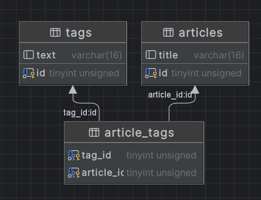

[toc]
# 多对多 many2many
Many to Many 会在两个 model 中添加一张连接表，将不同表的id连接起来，也就是说 总共三张表
我们这里以文章和其tag为例，一篇文章可以有多个tag，一个tag中也有多个文章

## 表结构搭建
```go
type Article struct {
	ID    uint   `gorm:"size:8"`
	Title string `gorm:"size:16"`
	Tags  []Tag  `gorm:"many2many:article_tags;"` //用于确定多对多的关系并指定第三张连接表的名字
}
type Tag struct {
	ID       uint      `gorm:"size:8"`
	Text     string    `gorm:"size:16"`
	Articles []Article `gorm:"many2many:article_tags;"`//反向引用，可以用来查询具有相同标签的文章
}

DB.AutoMigrate(&Article{}, &Tag{})
```
搭建表结构如图：


## 多对多添加
创建标签和文章：
&emsp;&emsp;建立一篇标题为“go”的文章，并新建标签为``study``和``language``。
```go
DB.Save(&Article{
	ID:    1,
	Title: "go",
	Tags: []Tag{
		{Text: "language"},
		{Text: "study"},
	},
})
```
添加文章，选择标签:这里以选择单个标签为例
如果不查询，即使标签名字一致也会重建一个新的标签
```go
var tag Tag
DB.Take(&tag, "Text=?", "study")
DB.Save(&Article{
	Title: "Study notes",
	Tags:  []Tag{tag},
})
```
## 多对多查询

```go
//查询文章，显示文章的标签列表
var article Article
DB.Preload("Tags").Take(&article, 1)
fmt.Println(article)

//查询标签，显示具有该标签的文章列表
var tag Tag
DB.Preload("Articles").Take(&tag, 2)
fmt.Println(tag)
```
## 多对多的删除、更新

移除文章的标签
```go
var article Article
DB.Preload("Tags").Take(&article, 1)
DB.Model(&article).Association("Tags").Delete(article.Tags)
fmt.Println(article)
```
跟新文章的标签
```go
article = Article{}
var tags []Tag

DB.Find(&tags, []int{1, 2, 3}) //找到想要添加的标签

DB.Preload("Tags").Take(&article, 1) //预加载要修改的文章

DB.Model(&article).Association("Tags").Replace(tags) //替换文章标签
```
# 自定义连接表
默认的连接表，只有双方的主键id，展示不了更多信息了，为了
```go
type Article struct {
	ID    uint
	Title string
	Tags  []Tag `gorm:"many2many:article2tag;"`
}

type Tag struct {
	ID   uint
	Text string
	//Articles []Article `gorm:"many2many:article2tag;"` //当使用反向引用时需要在setUpJoinTable时多设置一次这个表的 @@@
}

// Article2tag 自定义连接表
type Article2tag struct {
	ArticleID uint      `gorm:"primaryKey"`
	TagID     uint      `gorm:"primaryKey "` //上两项即为连接表默认项
	CreatedAt time.Time //自定义添加一个创建时间字段
}
```
## 生成表结构
```go
//第一个参数为具有连接另一个表的字段的连接表，第二个即为连接字段的字段名，第三个为连接表
DB.SetupJoinTable(&Article{}, "Tags", &Article2tag{})
//DB.SetupJoinTable(&Tag{}, "Articles", &Article2tag{}) //与上面反向引用时对应 @@@
DB.AutoMigrate(&Article{}, &Tag{}, &Article2tag{})
```

## 操作案例

### 添加文章并添加标签，并自动关联

### 添加文章，关联已有标签

### 给已有文章关联标签

### 替换已有文章的标签