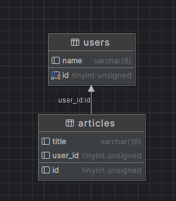

[toc]
# 一对多关系 Has Many-belongs to
[官方文档](https://gorm.io/zh_CN/docs/has_many.html#Has-Many)
has many 与另一个模型建立了一对多的连接。 不同于 has one，拥有者可以有零或多个关联模型。
>老板与员工
**女神和舔狗**
老师和学生
班级与学生
用户与文章...

&emsp;&emsp;例如，您的应用包含 user 和 article 模型，且每个 user 可以有多篇 article。

## 声明 belongs to
&emsp;&emsp;user为**主表**，由于一对多，在user结构中增加article切片；
&emsp;&emsp;article表为**副表**，在其中加入外键关联，即主表名+ID，再加入user结构体

&emsp;&emsp;``belongs to`` 会与另一个模型建立了一对一的连接。 这种模型的每一个实例都“属于”另一个模型的一个实例。
&emsp;&emsp;下面中的``user``和``article``由于是一对多的关系，**一** 的结构体中有多的切片，**多** 的结构体中包含以的单独结构体。(在一对一关系中，通常在子表结构体-有外键的一边-中包含主表的结构体，具体可以见[一对一部分的文章]())
<span id="jump"></span>

```go
// User 用户表 一个用户可以有多篇文章
type User struct {
	ID       uint   `gorm:"size:4"`
	Name     string `gorm:"size:8"`
	Articles []Article
}

// Article 文章表 一篇文章属于一个用户
type Article struct {
	ID     uint   `gorm:"size:4"`
	Title  string `gorm:"size:16"`
	UserID uint   `gorm:"size:4"`
	User   User
}
//使用automigrate进行表的迁移
DB.AutoMigrate(&User{}, &Article{})
```
&emsp;&emsp;**默认的外键名**是拥有者的类型名加上其主键字段名，这里外键名称就是关联表名+ID，不加备注不可以随便更改，会报错；且外键类型要和主表关联的字段类型一直，这里都为unit，size：4
可以得到建立的表的关系如图：



## 重写外键关联
&emsp;&emsp;想要使用另一个字段作为外键，您可以使用 foreignKey 标签自定义它：
```go
//重写外键关联----------------------------
//gorm的foreignKey备注写在对应的两个表的关联上
type User1 struct {
	ID       uint       `gorm:"size:4"`
	Name     string     `gorm:"size:8"`
	Articles []Article1 `gorm:"foreignKey:UID"`
}

type Article1 struct {
	ID    uint   `gorm:"size:4"`
	Title string `gorm:"size:16"`
	UID   uint   `gorm:"size:4"`
	User  User1  `gorm:"foreignKey:UID"`
}
```
关联外键的数据类型仍需一致，但是字段名不再受限制

## ~~重写引用~~ 

>**这里博主大失败，最后也没有搞出来，希望过路大神解答**
这里贴[官方文档](https://docs.fengfengzhidao.com/#/docs/gorm%E6%96%87%E6%A1%A3/7.%E4%B8%80%E5%AF%B9%E5%A4%9A%E5%85%B3%E7%B3%BB?id=%e9%87%8d%e5%86%99%e5%a4%96%e9%94%ae%e5%bc%95%e7%94%a8)

&emsp;&emsp;GORM 通常使用拥有者的**主键**作为外键的值。 对于上面的例子，它是 User 的 ID 字段。
&emsp;&emsp;为 user 添加 credit card 时，GORM 会将 user 的 ID 字段保存到 credit card 的 UserID 字段。
&emsp;&emsp;同样的，您也可以使用标签 references 来更改它，例如：
```go
//重写引用----------------------------
//备注写在对应的两个表的关联上

type User2 struct {
	ID       uint       `gorm:"size:4"`
	Name     string     `gorm:"size:8"`
	Articles []Article2 `gorm:"foreignKey:UserName;references:Name"`
}

type Article2 struct {
	ID       uint   `gorm:"size:4"`
	Title    string `gorm:"size:16"`
	UserName string `gorm:"size:8"`
	User     User2  `gorm:"references:Name"`
}
```
报错信息
> Error 1170 (42000): BLOB/TEXT column 'company_id' used in key specification without a key length

## 一对多的添加
```go
//创建用户的同时创建文章，并将两者关联
DB.Save(&User{
	Name: "wang2",
	Articles: []Article{
		{Title: "golang"},
		{Title: "python"},
	},
})

//这里save、create方法都可以
//创建文章，关联已有用户
//1.直接传入关联外键部分
DB.Save(&Article{Title: "easyGo", UserID: 2})

//2.查询过后传入对应结构体中
var user User
DB.Take(&user, 1)                           //查询已有用户
DB.Save(&Article{Title: "c++", User: user}) //将关联部分的User结构体传入
```

## 外键添加
### 常规方法
```go
// 常规方法
//常规方法-----------------------将id为8的文章和id为2的用户绑定
//现有用户，这里id=2
var user User
DB.Take(&user, 2)

//现有文章，id=8，未设置用户
var article Article
DB.Take(&article, 8)

//方法1.给现有用户绑定文章
user.Articles = []Article{article}//[{8 c语言 2 {0  []}}]
DB.Save(&user)

//方法2.给现有文章关联用户
article.User = user //{2 wang2 []}
DB.Save(&article)
```

### append方法
association方法中为关联二表的部分，这里为articels和User
```go
//append方法--------将id为8的文章和id为2的用户绑定
var user User
DB.Take(&user, 2)
var article Article
DB.Take(&article, 8)
//1.用户绑定文章
//model在选表的同时也在选择对象
//DB.Model(&User{ID: 2}).Association("Articles").Append(&article)
DB.Model(&user).Association("Articles").Append(&article)
//2.文章关联用户
DB.Model(&article).Association("User").Append(&user)
```
[前文user、article定义部分](#jump)

## 查询、预加载
&emsp;&emsp;GORM 可以通过 Preload 预加载 has many 关联的记录，查看 [预加载](https://gorm.io/zh_CN/docs/preload.html) 获取详情
&emsp;&emsp;预加载的名字就是外键关联的属性名，**大小写、复数形式敏感**
```go
//查询 不加载，无法查看
var userList []User
DB.Find(&userList)
fmt.Println(userList) 
//[{1 wang []} {2 wang2 []}]

user = User{}
//查询 预加载
DB.Preload("Articles").Take(&user, 1)
fmt.Println(user) 
//{1 wang [{1 golang 1 {0  []}} {2 python 1 {0  []}} {5 c++ 1 {0  []}}]}
```
### 嵌套预加载
```go
//嵌套预加载 结构体中内容再展示一层
DB.Preload("Articles.User").Take(&user, 1)
fmt.Println(user)
//{1 wang [{1 golang 1 {1 wang []}} {2 python 1 {1 wang []}} {5 c++ 1 {1 wang []}}]}
```
查询文章，显示用户，并且显示用户关联的所有文章
### 带条件的预加载
```go
//带条件的预加载
//这里只预加载id=1的文章
DB.Preload("Articles", "id=?", 1).Take(&user) //
fmt.Println(user)//{1 wang [{1 golang 1 {0  []}}]}
```
自定义预加载等更深入内容请查看[官方文档](https://gorm.io/zh_CN/docs/preload.html)

## 删除
### 级联删除
删除用户，与用户相关的文章也清除
```go
//级联删除
user = User{}
DB.Preload("Articles").Take(&user, 1)
DB.Select("Articles").Delete(&user)
```

### 清楚外键关系
将与用户关联的文章，外键设置为null；删除用户
用户作为主表中数据无法直接删除
```go
// 将id=2的用户的文章与其断开关系,并将用户删除
user = User{}
DB.Preload("Articles").Take(&user, 2)
DB.Model(&user).Association("Articles").Delete(&user.Articles)
DB.Delete(&user)
```

所有代码集合：
```go
package main

import (
	"fmt"
	"gorm.io/driver/mysql"
	"gorm.io/gorm"
	"gorm.io/gorm/logger"
)

var DB *gorm.DB

func init() {
	username := "root"
	password := "123456"
	host := "127.0.0.1"
	port := 3306
	Dbname := "gorm"
	timeout := "10s"

	dsn := fmt.Sprintf("%s:%s@tcp(%s:%d)/%s?charset=utf8mb4&parseTime=True&loc=Local&timeout=%s", username, password, host, port, Dbname, timeout)
	db, err := gorm.Open(mysql.Open(dsn), &gorm.Config{
		Logger: logger.Default.LogMode(logger.Info),
	})
	if err != nil {
		fmt.Println("连接数据库失败, error=", err)
		return
	}
	DB = db
	fmt.Println("数据库连接成功")
}

//表结构关联-----------------------
// User 用户表 一个用户可以有多篇文章

type User struct {
	ID       uint   `gorm:"size:4"`
	Name     string `gorm:"size:8"`
	Articles []Article
}

// Article 文章表 一篇文章属于一个用户
type Article struct {
	ID     uint   `gorm:"size:4"`
	Title  string `gorm:"size:16"`
	UserID uint   `gorm:"size:4"`
	User   User
}

//重写外键关联----------------------------
//gorm的foreignKey备注写在对应的两个表的关联上
//
//type User1 struct {
//	ID       uint       `gorm:"size:4"`
//	Name     string     `gorm:"size:8"`
//	Articles []Article1 `gorm:"foreignKey:UID"`
//}
//
//type Article1 struct {
//	ID    uint   `gorm:"size:4"`
//	Title string `gorm:"size:16"`
//	UID   uint   `gorm:"size:4"`
//	User  User1  `gorm:"foreignKey:UID"`
//}

//重写引用----------------------------
//备注写在对应的两个表的关联上

//type User2 struct {
//	ID       uint       `gorm:"size:4"`
//	Name     string     `gorm:"size:8"`
//	Articles []Article2 `gorm:"foreignKey:UserName;references:Name"`
//}
//
//type Article2 struct {
//	ID       uint   `gorm:"size:4"`
//	Title    string `gorm:"size:16"`
//	UserName string `gorm:"size:8"`
//	User     User2  `gorm:"references:Name"`
//}

func main() {
	//DB.AutoMigrate(&User{}, &Article{})
	//DB.AutoMigrate(&User1{}, &Article1{})
	//DB.AutoMigrate(&User2{}, &Article2{})

	////创建用户的同时创建文章，并将两者关联
	//DB.Save(&User{
	//	Name: "wang2",
	//	Articles: []Article{
	//		{Title: "golang"},
	//		{Title: "python"},
	//	},
	//})

	////创建文章，关联已有用户
	////1.直接传入关联外键部分
	//DB.Save(&Article{Title: "easyGo", UserID: 2})
	//
	////2.查询过后传入对应结构体中
	//var user User
	//DB.Take(&user, 1)                           //查询已有用户
	//DB.Save(&Article{Title: "c++", User: user}) //将关联部分的User结构体传入

	//外键添加
	//常规方法-----------------------将id为8的文章和id为2的用户绑定
	//现有用户，这里id=2
	//var user User
	//DB.Take(&user, 2)

	//现有文章，id=8，未设置用户
	//var article Article
	//DB.Take(&article, 8)

	//方法1.给现有用户绑定文章
	//user.Articles = []Article{article}//[{8 c语言 2 {0  []}}]
	//DB.Save(&user)

	//方法2.给现有文章关联用户
	//article.User = user //{2 wang2 []}
	//DB.Save(&article)
	//-------------------------------------
	//append方法--------将id为8的文章和id为2的用户绑定
	var user User
	DB.Take(&user, 2)
	var article Article
	DB.Take(&article, 8)
	//1.用户绑定文章
	//model在选表的同时也在选择对象
	//DB.Model(&User{ID: 2}).Association("Articles").Append(&article)
	DB.Model(&user).Association("Articles").Append(&article)
	//2.文章关联用户
	DB.Model(&article).Association("User").Append(&user)

	//查询 不加载，无法查看
	var userList []User
	DB.Find(&userList)
	fmt.Println(userList) //[{1 wang []} {2 wang2 []}]

	user = User{}
	//查询 预加载
	DB.Preload("Articles").Take(&user, 1)
	fmt.Println(user) //{1 wang [{1 golang 1 {0  []}} {2 python 1 {0  []}} {5 c++ 1 {0  []}}]}

	user = User{}
	//嵌套预加载 结构体中内容再展示一层
	DB.Preload("Articles.User").Take(&user, 1)
	fmt.Println(user)
	//{1 wang [{1 golang 1 {1 wang []}} {2 python 1 {1 wang []}} {5 c++ 1 {1 wang []}}]}

	user = User{}
	//带条件的预加载
	//这里只预加载id=1的文章
	DB.Preload("Articles", "id=?", 1).Take(&user) //
	fmt.Println(user)
	//{1 wang [{1 golang 1 {0  []}}]}

	// 将id=2的用户的文章与其断开关系,并将用户删除
	user = User{}
	DB.Preload("Articles").Take(&user, 2)
	DB.Model(&user).Association("Articles").Delete(&user.Articles)
	DB.Delete(&user)

	//级联删除
	user = User{}
	DB.Preload("Articles").Take(&user, 1)
	DB.Select("Articles").Delete(&user)
}

```