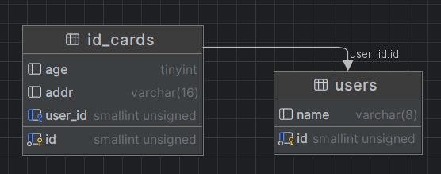

# 一对一关系-Has One-belongs to
[官方文档](https://gorm.io/zh_CN/docs/has_one.html)
``has one``与另一个模型建立一对一的关联，但它和一对一关系有些许不同。 这种关联表明一个模型的每个实例都包含或拥有另一个模型的一个实例。
例如User和IdCard，每个user只有一张IdCard

&emsp;&emsp;一对一关系比较少，一般用于表的扩展
&emsp;&emsp;例如一张用户表，有很多字段
&emsp;&emsp;那么就可以把它拆分为两张表，常用的字段放主表，不常用的字段放详情表

## 表结构搭建-belongs to
我们建立两张表，一张用户表user，一张身份证表idcard
user表中有主键id和姓名，idcard中有对应的用户id以及其他

**初始化相关表格语句：**
```go

package main

import (
	"fmt"
	"gorm.io/driver/mysql"
	"gorm.io/gorm"
	"gorm.io/gorm/logger"
)

var DB *gorm.DB

func init() {
	username := "root"
	password := "123456"
	host := "127.0.0.1"
	port := 3306
	Dbname := "gorm"
	timeout := "10s"

	dsn := fmt.Sprintf("%s:%s@tcp(%s:%d)/%s?charset=utf8mb4&parseTime=True&loc=Local&timeout=%s", username, password, host, port, Dbname, timeout)
	db, err := gorm.Open(mysql.Open(dsn), &gorm.Config{
		Logger: logger.Default.LogMode(logger.Info),
	})
	if err != nil {
		fmt.Println("连接数据库失败, error=", err)
		return
	}
	DB = db
	fmt.Println("数据库连接成功")
}

type User struct {
	ID   uint   `gorm:"size:16"`
	Name string `gorm:"size:8"`
}

type IDCard struct {
	ID     uint   `gorm:"size:16"`
	Age    int    `gorm:"size:4"`
	Addr   string `gorm:"size:16"`
	UserID uint   `gorm:"size:16"` //外键
	User   User   //关联的主表结构体
}

func main() {
	DB.AutoMigrate(&User{}, &IDCard{})
}
```

## 添加记录
```go
//同时添加两个表的信息
//这里只能使用create，不能使用save（why？）	  
DB.Create(&User{
	ID:   1,
	Name: "wang2",
	IDCard: &IDCard{
		ID:   123,
		Age:  18,
		Addr: "shandong",
	},
})

//将新建的idcard绑定到已有user上
//DB.Save(&User{Name: "cc"})
DB.Save(&IDCard{ID: 456, UserID: 2})
```